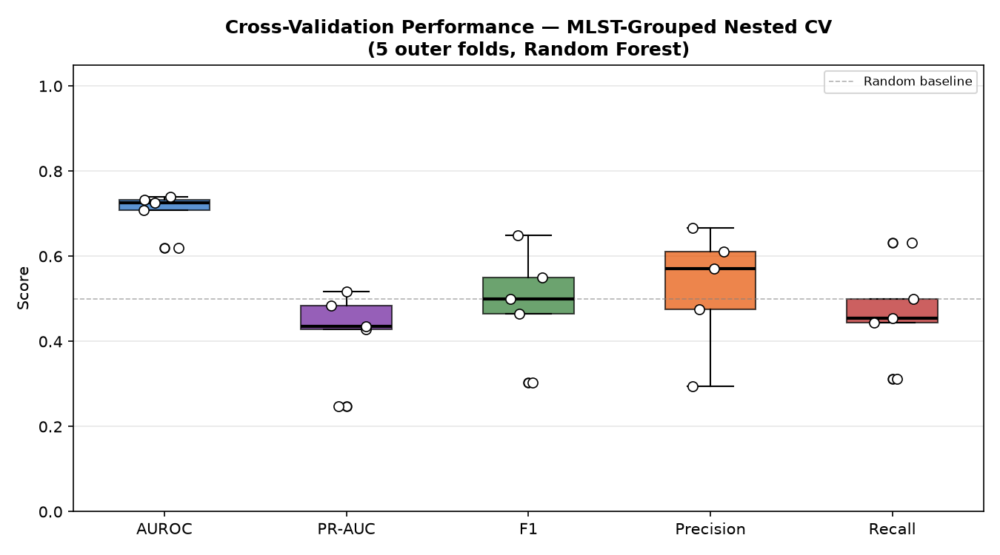
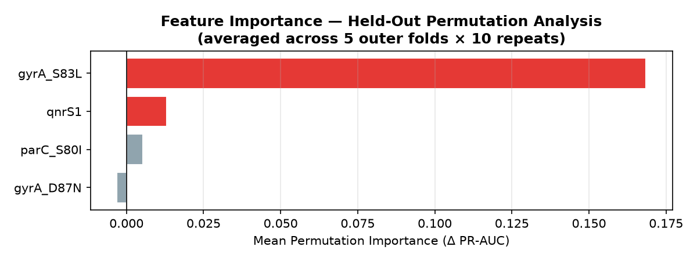
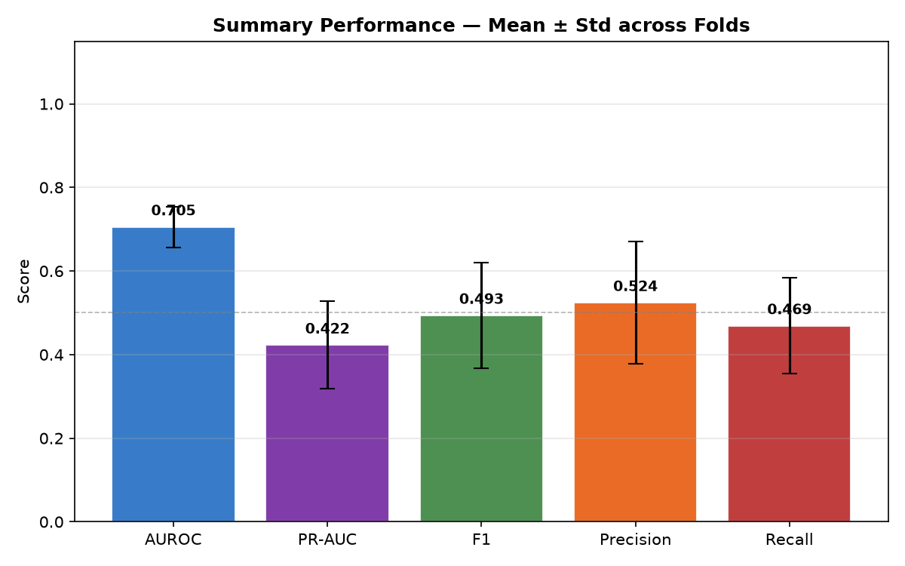

# Lineage-Aware Machine-Learning Template for AMR Classification

A reproducible, rigorously validated template for **antimicrobial resistance (AMR) phenotype classification** from genomic feature matrices. Designed to prevent lineage leakage through MLST-grouped nested cross-validation with inner-fold threshold selection.

---

## Background

AMR classification from whole-genome sequencing data is confounded by **lineage structure** — phylogenetically related isolates sharing both genomic features and resistance phenotypes. Standard cross-validation that splits randomly will leak lineage signal, inflating performance estimates. This template uses **MLST sequence type grouping** to ensure entire lineages appear in either train or test, never both.

---

## Pipeline

```
Input: Genome feature matrix (binary SNP/gene presence) + MLST groups + phenotype labels
        ↓
Schema validation  →  check required columns, no duplicates, binary labels
        ↓
MLST-grouped outer CV (5 folds)
  └── MLST-grouped inner CV (3 folds) per outer fold
        └── Train Random Forest → predict on inner val set
        └── Pool inner val predictions → tune F1 threshold
      Train final model on outer train → evaluate on outer test
      Permutation importance on held-out test (10 repeats, PR-AUC scoring)
        ↓
Aggregate metrics across folds (mean ± std)
Export: CSVs + 3 visualisation plots
```

---

## Key Results (Synthetic Demo)

| Metric | Mean ± Std |
|---|---|
| AUROC | 0.705 ± 0.049 |
| PR-AUC | 0.422 ± 0.105 |
| F1 | 0.493 ± 0.127 |
| Precision | 0.524 ± 0.146 |
| Recall | 0.469 ± 0.115 |

**Permutation importance correctly recovers causal features** (`gyrA_S83L`, `parC_S80I`) over noise features (`gyrA_D87N`, `qnrS1`), validating the importance analysis.





---

## Project Structure

```
amr_classification/
├── src/
│   ├── __init__.py
│   ├── validate_schema.py    — input validation (columns, labels, duplicates)
│   ├── split_by_mlst.py      — MLST-grouped GroupKFold splitter
│   ├── train.py              — Random Forest training
│   └── evaluate.py           — threshold tuning, metrics, permutation importance
├── demo/
│   └── synthetic_example.py  — end-to-end demo with synthetic data
├── results/
│   ├── fold_metrics.csv
│   ├── summary_metrics.csv
│   ├── permutation_importances.csv
│   ├── cv_metrics_boxplot.png
│   ├── permutation_importance.png
│   └── summary_metrics_bar.png
├── requirements.txt
└── README.md
```

---

## Using with Real Data

Replace `generate_mock_data()` in `demo/synthetic_example.py` with your own DataFrame. It must have:

| Column | Type | Description |
|---|---|---|
| `Genome_ID` | string | Unique genome identifier |
| `MLST_Group` | string | MLST sequence type (e.g. `ST131`) |
| `Phenotype_Resistant` | int (0/1) | Resistance phenotype label |
| `feature_*` | int (0/1) | Binary genomic features (SNPs, gene presence) |

---

## Getting Started

```bash
git clone https://github.com/kanishkkadyan/amr-classification-ml.git
cd amr-classification-ml
pip install -r requirements.txt
python demo/synthetic_example.py
```

---

## Design Decisions

| Choice | Rationale |
|---|---|
| MLST-grouped CV | Prevents lineage leakage — standard in genomic epidemiology ML |
| Inner-fold threshold tuning | Isolates threshold selection from outer evaluation |
| Permutation importance | Model-agnostic; evaluated on held-out data only |
| PR-AUC as importance scorer | More informative than accuracy under class imbalance |
| `class_weight="balanced"` | Corrects for typical ~20–30% resistance prevalence |

---

## References

- Weis, C. et al. (2022). Direct antimicrobial resistance prediction from clinical MALDI-TOF mass spectrometry. *Nature Medicine*, 28, 164–174.
- Moradigaravand, D. et al. (2018). Prediction of antibiotic resistance in *Escherichia coli* from large-scale pan-genome data. *PLOS Computational Biology*, 14, e1006258.
- Pedregosa, F. et al. (2011). Scikit-learn: Machine Learning in Python. *JMLR*, 12, 2825–2830.
